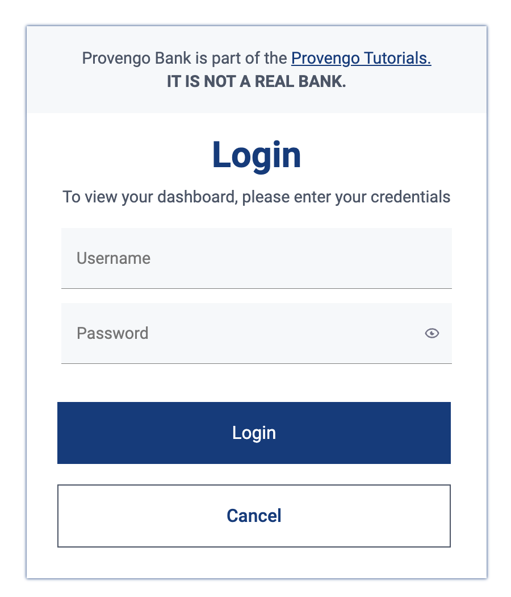
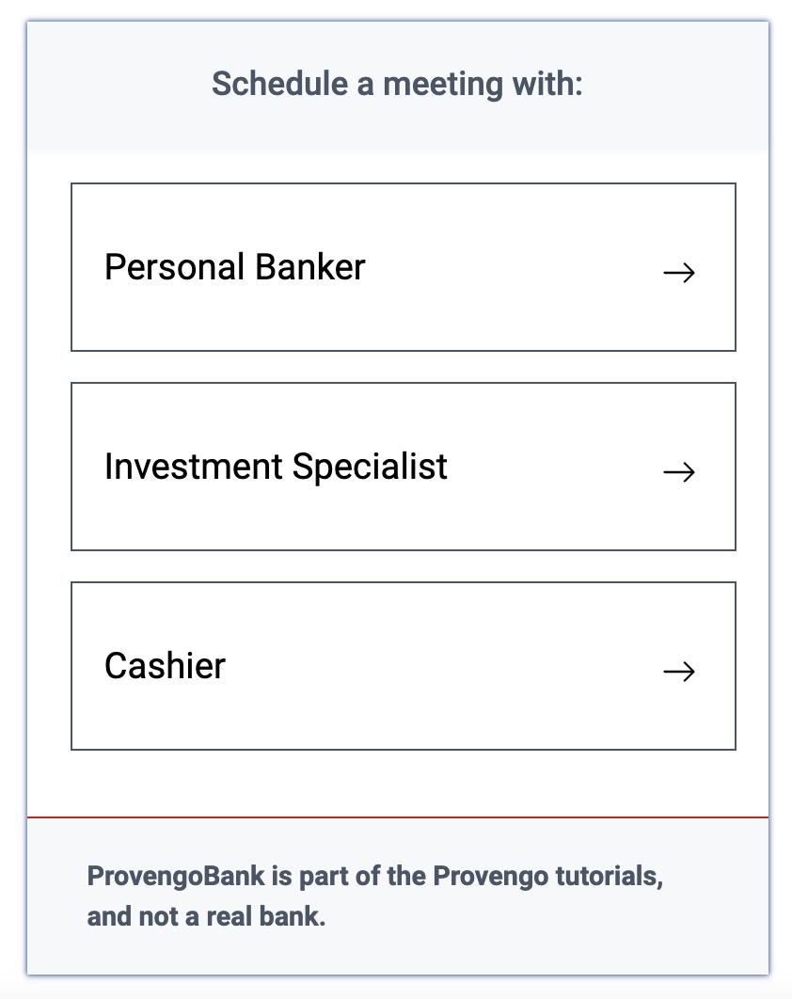

= Dummy bank tutorial
:page-pagination:
:description: Short Introduction to the dummy-bank tutorial-website.
:keywords: Dummy-Bank, Bank, tutorial website

In this short tutorial we`ll present you to our https://dummy-bank.provengo.tech/[Dummy-Bank website]. 
This is an example based on the real world, which simulates the process of scheduling an appointment at the bank. 

IMPORTANT: _Provengo Dummy Bank_ is not a real bank. It is a part of the _Provengo tutorials sites_ and is used to demonstrait a common use-case of the Provengo tool. 

When completing this tutorial you'll know::
    The basic behavior and main flow of the _Dummy Bank_ app. +
    The different screens appearing based on different user inputs. +
    How to begin testing the _Dummy-Bank_ app and further tutorials. +

This is useful because::
    It is a real-world example, showing some classic flow, screens and features that are very common in webapps. +
    Understanding the app flow is important to better understanding how to use the Provengo tool when later testing the _Dummy Bank_ by yourself, or when following other _Dummy Bank_ hands-on tutorials. +

---

## Main Flow:

In this section, we'll provide a comprehensive overview of the Provengo Dummy Bank App, which allows users to schedule appointments with their desiered service and branch. 

### User Login

- Credenitals to use: +
      username:   `teddyBear123` +
      password:   `Bear123`

- Find the complete list of dummy-users [here]. This can be useful later on when testing.
- User enters their credentials and clicks "Login".

### Dashboard

- After successful login, the user is redirected to the dashboard where they can start the scheduling process.

### Scheduling Meetings

- Find the "Schedule a meeting with" panel on the right hand side of the dashboard. 

- **Choose Service and Topic**

    * There are 3 service options - Banker, Investment Specialist or a Cashier. 
    * User clicks on the desiered service button.

    * User is prompted with a dialog box to further choose a topic for their meeting. 
    * The topics change according to the selected service.

IMPORTANT: If the user choose to meet with a *cashier*, then they also need to select the branch. Otherwise, they only need to set the time. The branch is set automatically to their home branch. 

- **Set Time and Branch** 

    * User is redirected to a new screen to set the desiered time and branch for the meeting. 

    * User can select the hour for the meeting by clicking on one of the hour-buttons suggested in the scheduler panels. 

    * User clicks on the "continue" button. 

NOTE: Whenever the user decides to click on the "back" button, all the details he already filled in, should still be available.

### User Contact Information

- User is redirected to a new screen to fill in his contact info. 

- User should fill in at least one of the following details: 
    * valid phone number.
    * valid email address. 

- User clicks on the "continue" button. 

### User Confirmation

- User is redirected to a new screen to validate and confirm his meeting details and contact information. 

- User clicks on the "Schedule My Meeting" button.

### System Confirmation

- User is redirected to a new screen to recieve a system confirmation message.

- User can add the scheduled meeting to his calendar, print it or download it by clicking one of the buttons.

## What's Next?
- Continue playing with the _Dummy Bank_ app. Get comfortable with it. And when you feel ready, jump right into the next tutorial to see how to use the provengo tool to test the app.
- Check out our other _Dummy Bank_ tutorials to start testing the app using one of the provengo's DSLs.

    * Dummy Bank Stateory (StateMachines)
    * Dummy Bank Combi 
    * Dummy Bank Storylines

---

